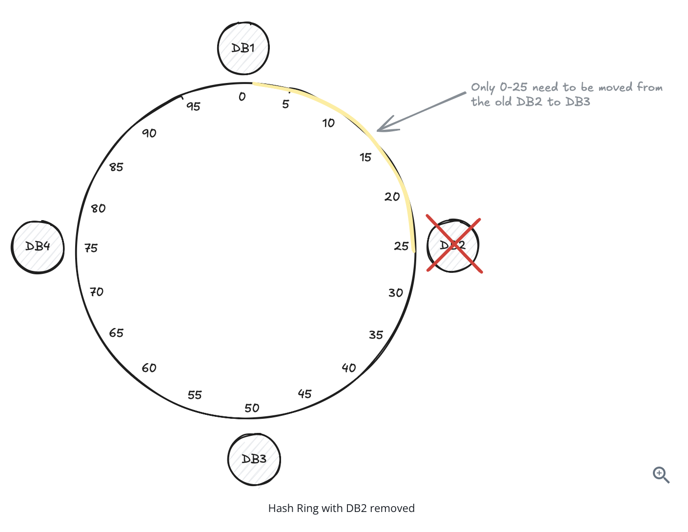

# Consistent Hashing — My Notes

## 1. The Problem

**Setup:**
```
Client  <--->  Server  <--->  Database(s)
```

We have multiple database servers (DB1, DB2, DB3...) and we need a rule
for "which DB should store this event/data?"

### Naive approach: `event_id % number_of_servers`

- Hash the event id to a number, then mod it by the number of DB servers.
- Result (say 1, 2, or 3) tells you which DB to store it in.

Example with 3 DBs:
```
event_id % 3  ->  0 = DB1, 1 = DB2, 2 = DB3
```

This works... until you scale.

### Why it breaks when you add/remove a server

If you go from 3 servers to 4 servers, the formula changes from
`% 3` to `% 4`. Almost **every** event now maps to a different server
than before.

```
BEFORE (3 servers)          AFTER (4 servers)
id=10 -> 10%3=1 -> DB2      id=10 -> 10%4=2 -> DB3   (moved!)
id=11 -> 11%3=2 -> DB3      id=11 -> 11%4=3 -> DB4   (moved!)
id=12 -> 12%3=0 -> DB1      id=12 -> 12%4=0 -> DB1   (stayed, lucky)
```

Result: **massive, unnecessary data movement.** Almost all keys get
reshuffled just because you added one server. This can overload the
network/DBs and even cause crashes (a "rebalancing storm").

**Same problem happens when removing a server** — everything reshuffles again.

---

## 2. The Solution: Consistent Hashings

**Core idea:** don't hash against "number of servers." Instead, place
both the **servers** and the **data (keys)** onto the same fixed
circular space — the "hash ring" — so adding/removing a server only
disturbs a small, local part of the ring.

### Step 1: Build the ring

- Take a fixed range, e.g. `0 to 100` (real systems usually use
  `0 to 2^32`, but 0-100 is easier to picture).
- Arrange this range as a **circle** (ring), not a straight line —
  position 100 wraps back around to 0.

### Step 2: Place the servers on the ring

Hash each server's name/ID → gives it a fixed point on the ring.



### Step 3: Place the data on the ring

- Hash the event/key id → this gives it a point on the ring too.
- **Rule:** walk clockwise from that point until you hit the first
  server. That's the server this event belongs to.

```
Event "X" hashes to position 30.
Walking clockwise from 30, the first server hit is DB3 (at 55).
=> Event X is stored in DB3.
```

### Step 4: Why this fixes rebalancing

**Adding a 5th server (DB5):**
- DB5 gets placed at some new point on the ring.
- Only the events that fall *between DB5's new position and the
  previous server (going counter-clockwise)* need to move — they now
  hit DB5 first when walking clockwise, instead of the old server.
- **Every other event on the ring is untouched.**

**Removing a server (say DB2):**
- Only the events that used to belong to DB2 need to move — they'll
  now walk clockwise and land on the next server instead.
- All other events (belonging to DB1, DB3, etc.) are untouched.

```
Before removing DB2:              After removing DB2:
 ... -> [DB2's keys] -> DB3 ...    ... -> [DB2's keys now go] -> DB3 ...
      (only DB2's slice moves, nothing else changes)
```

This is the big win over `% N`: **only a small slice of data moves**,
not the whole dataset.

---

## 3. The Uneven Distribution Problem

With only a few points on the ring, servers can end up unevenly
spaced — one server might "own" a much bigger arc of the ring than
others, so it gets way more traffic/data.

```
Uneven (bad):
        ●DB1 (tiny slice)
   ●DB3
                              ●DB2
        (huge gap before DB2 = DB2 handles most of the keys)
```

### Solution: Virtual Nodes (vnodes)

- Instead of placing each physical server on the ring **once**,
  place it at **many points** (virtual nodes) scattered around the
  ring.
- E.g., DB1 might actually appear as `DB1-v1, DB1-v2, DB1-v3...` at
  many different ring positions, all mapping back to the real DB1.

```
Ring with virtual nodes (evenly scattered):
  DB1a  DB2a  DB1b  DB3a  DB2b  DB1c  DB3b  DB2c ...
```


**Result:** much more even distribution of data/load across servers,
and rebalancing on add/remove is still cheap (only the affected
vnodes' keys move).

---

## 4. Quick Summary Table

| Approach                            | Add/Remove a server                      | Distribution |
|--------------------------------------|-------------------------------------------|---------------|
| `id % N` (naive)                     | Almost all keys reshuffle                  | Even (if N is stable) |
| Consistent hashing                   | Only keys near the new/removed node move   | Can be uneven |
| Consistent hashing + virtual nodes   | Only keys near the new/removed node move   | Even |

---

## 5. Where It's Actually Used

- **Redis Cluster** — hash slots (a variant of this idea)
- **Cassandra** — ring-based partitioning with vnodes
- **DynamoDB** — consistent hashing for partition placement
- **CDNs** — routing requests to the correct/nearest edge server
- Core building block for: **distributed caches**, **message queues**,
  and any horizontally-scaled data system.

---

## 6. One-Line Takeaway

> Consistent hashing puts servers and data on the same ring so that
> adding/removing a server only reshuffles the small slice of data
> near that server — not the whole dataset. Virtual nodes fix uneven
> load by giving each server many small slices instead of one big one.